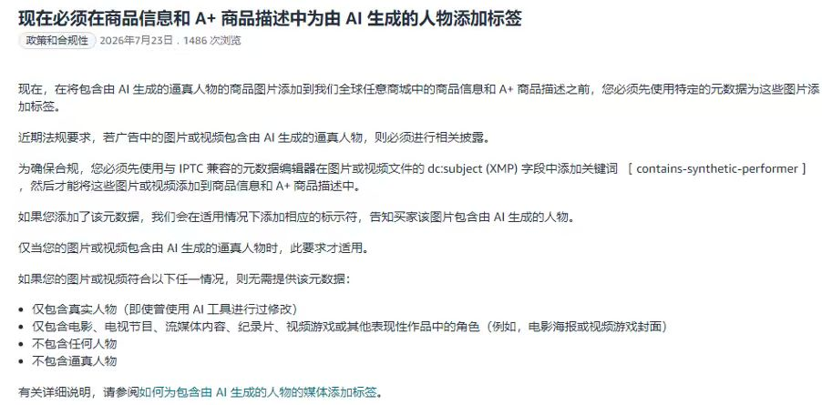
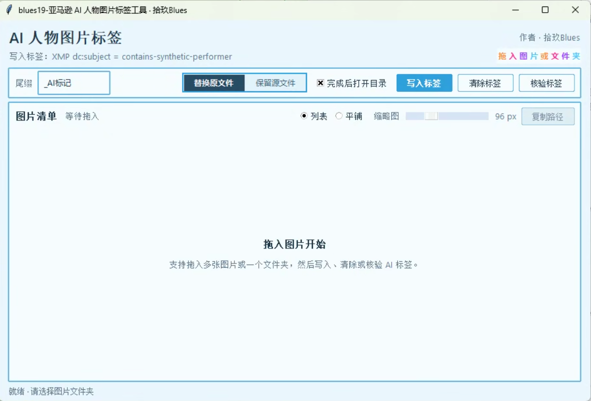
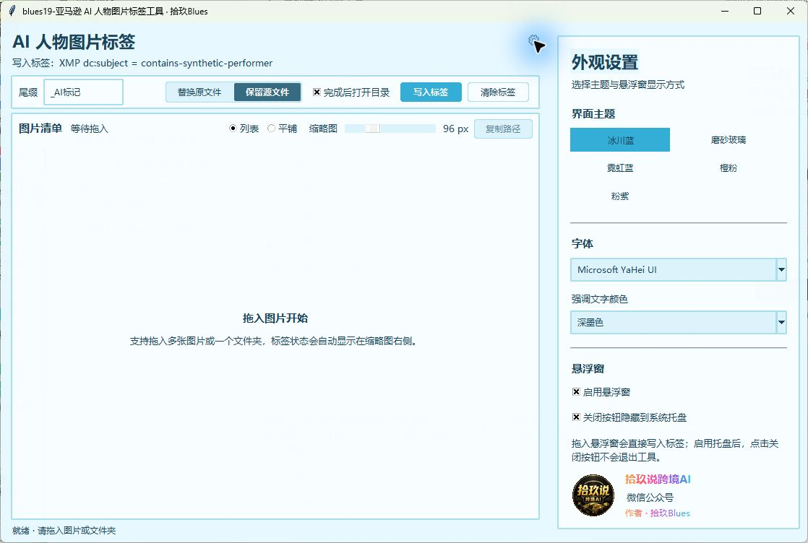

# blues19 亚马逊 AI 人物图片标签工具

一个面向 Windows 的图片元数据工具，用于给包含 AI 生成逼真人物的商品图片写入亚马逊要求的 XMP 标签：

```text
XMP dc:subject = contains-synthetic-performer
```

作者：拾玖Blues
公众号：拾玖说跨境AI

## 为什么做这个工具

亚马逊要求：当商品信息、A+ 商品描述或广告素材中的图片或视频包含 AI 生成的逼真人物时，需要先在媒体文件的 `dc:subject`（XMP）字段中加入关键词 `contains-synthetic-performer`，再上传到相关内容。

手动逐张修改元数据容易漏标，也不方便核验。本工具把写入、清除、复查和批量处理集中到一个桌面面板中，并提供可拖入图片的悬浮窗，减少重复操作。



> 上图是本工具立项时保存的亚马逊政策页面截图，仅用于说明开发背景。平台规则可能更新，实际发布前请以亚马逊当前政策和账户后台提示为准。

## 适用范围

当图片包含 AI 生成的逼真人物时，可使用本工具写入标签。

根据截图中的政策说明，以下情况通常不要求添加该标签：

- 仅包含真实人物，即使使用 AI 工具进行过修改。
- 仅包含电影、电视节目、流媒体内容、纪录片、视频游戏或其他表现性作品中的角色。
- 不包含任何人物。
- 不包含逼真人物。

## 界面预览与说明

### 主操作面板



主面板用于完成日常批量处理：

- 将一张或多张图片、一个图片文件夹直接拖入空白区域。
- 在顶部设置输出文件尾缀，并切换“替换原文件”或“保留源文件”。
- “完成后打开目录”默认启用，写入结束后会自动打开输出位置。
- 点击“写入标签”批量写入，点击“清除标签”撤销本工具写入的目标标签。
- 图片载入后可使用列表或平铺视图，并调整缩略图大小。
- 每张缩略图右侧直接显示是否包含 `contains-synthetic-performer`，无需单独核验按钮。

### 悬浮窗快速写入


上图由当前版本的悬浮窗绘制参数直接生成，与程序内 88 × 88 高 DPI 悬浮窗一致，不含旧版粉色外圈。

悬浮窗用于少量图片的快速处理：

- 把图片直接拖到圆形悬浮窗，工具会立即按主面板当前模式写入并复查标签。
- 写入成功后显示绿色圆环和完成标记，不再弹出结果对话框。
- 悬浮窗支持拖动；双击或右键可唤回主窗口。
- 是否显示悬浮窗可在设置中切换。

### 设置面板



点击主窗口右上角的齿轮，设置区会从窗口右侧展开：

- 主题：切换七彩字、磨砂玻璃、霓虹蓝、橙粉和粉紫等外观。
- 字体：默认使用微软雅黑，也可选择其他可用字体。
- 文字颜色：应用到整个操作面板；公众号和作者署名保持七彩渐变效果。
- 悬浮窗：控制是否启用圆形快速写入入口。
- 设置会自动保存，下次启动继续使用。

## 功能

- 将多张图片或一个文件夹拖入主面板。
- 将图片拖入圆形悬浮窗后立即写入并核验标签。
- 成功后悬浮窗显示绿色完成灯效。
- 批量写入 XMP `dc:subject` 标签 `contains-synthetic-performer`。
- 清除由本工具写入的上述标签并复查结果。
- 防止重复写入同一个标签。
- 支持“替换原文件”和“保留源文件并生成副本”两种模式。
- 自定义输出文件名尾缀，默认 `_AI标记`。
- 文件名冲突时自动增加序号，避免覆盖已有文件。
- 写入完成后默认打开输出目录。
- 自动读取并在缩略图右侧显示标签状态。
- 支持列表和平铺视图及缩略图大小调整。
- 支持复制内部保存的文件路径清单，但界面不直接显示完整路径。
- 批量操作在后台执行，不使用阻塞式结果弹窗。
- 支持 Windows 高 DPI、2K 和 4K 显示缩放。
- 支持冰川蓝、磨砂玻璃、霓虹蓝、橙粉和粉紫主题。
- 标题栏、滚动条、输入框和下拉框跟随主题。
- 支持字体与面板文字颜色设置，默认微软雅黑和深墨色。
- 设置面板展示“拾玖说跨境AI”品牌 LOGO 与作者信息。

## 下载与运行

从 [GitHub Releases](https://github.com/ivan51769/blues19-amazon-ai-image-label-tool/releases/latest) 下载：

```text
blues19-amazon-ai-image-label-tool.exe
```

可同时下载 `blues19-SHA256SUMS.txt`，使用 Windows PowerShell 校验文件完整性：

```powershell
Get-FileHash .\blues19-amazon-ai-image-label-tool.exe -Algorithm SHA256
```

确认输出与校验文件中的 SHA-256 一致后，直接双击 EXE 运行。

如果从源码运行，双击：

```text
blues19-启动工具.cmd
```

## 交给 Agent 一句话安装

如果电脑上有 Codex、Claude Code 等能够执行 Windows 操作的 Agent，直接复制 [Agent 一句话安装提示词](blues19-AGENT_INSTALL_PROMPT.md) 即可。

提示词包含来源确认、独立环境安装、测试、EXE 构建、桌面快捷方式、启动验证和安全边界。Agent 必须给出实际验证结果，不能只报告“安装成功”。

## 使用方法

### 主面板

1. 选择“替换原文件”或“保留源文件”。
2. 根据需要修改文件名尾缀。
3. 将图片或单个文件夹拖入主面板。
4. 查看缩略图和当前标签状态。
5. 点击“写入标签”或“清除标签”。

### 悬浮窗快速写入

1. 在设置中启用悬浮窗。
2. 将图片或单个文件夹直接拖入圆形悬浮窗。
3. 工具会按照主面板当前的写入模式和尾缀设置立即处理。
4. 写入并核验成功后，悬浮窗会短暂显示绿色圆环和勾号。

悬浮窗支持拖动；双击或右键悬浮窗可以唤回主窗口。

## 两种输出模式

### 保留源文件

复制原图片，给副本添加尾缀并写入标签。原始图片保持不变。

### 替换原文件

直接给原图片写入标签，然后将文件重命名为带尾缀的名称。

两种模式都不会重新压缩图片画面，只会更新文件元数据；但任何文件操作都建议提前保留重要素材备份。

## 支持格式

- JPG / JPEG
- PNG
- WebP
- TIF / TIFF

## 数据与隐私

- 所有图片处理均在本机完成。
- 工具不会上传图片或元数据。
- 设置保存在当前 Windows 用户的 `%APPDATA%\blues19-ai-image-label-tool` 目录。
- 工具不会读取账户密码、浏览器登录信息或亚马逊账户数据。
- 写入和读取元数据由随程序打包的 ExifTool 完成。

## 从源码构建

环境：

- Windows 10 或 Windows 11
- Python 3.12
- Pillow
- tkinterdnd2
- PyInstaller

安装 Python 依赖：

```powershell
python -m pip install Pillow tkinterdnd2 pyinstaller
```

运行测试：

```powershell
python -m unittest discover -s tests -v
```

构建 EXE：

```powershell
python -m PyInstaller --noconfirm --clean blues19-amazon-ai-image-label-tool.spec
```

生成文件位于：

```text
dist\blues19-amazon-ai-image-label-tool.exe
```

## 项目文件

- `blues19-app.py`：主程序。
- `blues19-amazon-ai-image-label-tool.spec`：PyInstaller 构建配置。
- `blues19-启动工具.cmd`：源码启动脚本。
- `blues19-brand-logo.png`：品牌 LOGO。
- `blues19-amazon-ai-label-policy.jpg`：亚马逊政策背景截图。
- `blues19-docs-main-panel.png`：主操作面板截图。
- `blues19-docs-floating-bubble.png`：当前悬浮窗样式预览。
- `blues19-docs-settings-panel.png`：设置面板截图。
- `blues19-AGENT_INSTALL_PROMPT.md`：交给 Agent 的一句话安装与验收提示词。
- `blues19-SHA256SUMS.txt`：Release 成品的 SHA-256 校验值。
- `tests\test_core.py`：核心功能测试。
- `tools\exiftool.exe`：本地元数据处理组件。

## 第三方组件

本项目使用 ExifTool 读取和写入图片元数据。组件位于 `tools\exiftool.exe`，版权与许可信息见 `tools\README.txt`。

## 免责声明

本项目是非官方辅助工具，与 Amazon 无隶属或背书关系。政策截图和本文说明不构成法律、合规或平台政策建议。Amazon 及相关名称、标识归其各自权利人所有。

## ☕ 请作者喝杯咖啡

如果这个小工具节省了你的时间，可以自愿支持作者。

- 公众号：拾玖说跨境AI
- 作者：拾玖Blues


